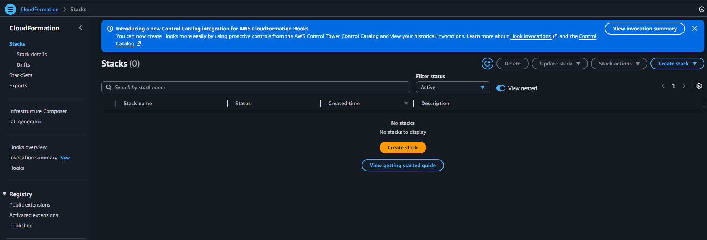
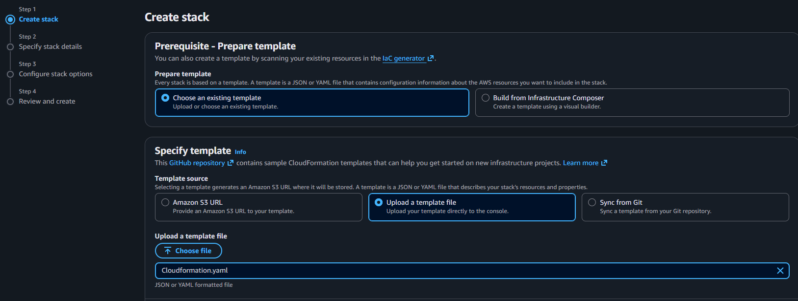
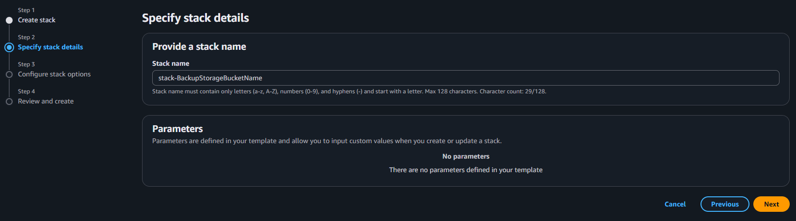
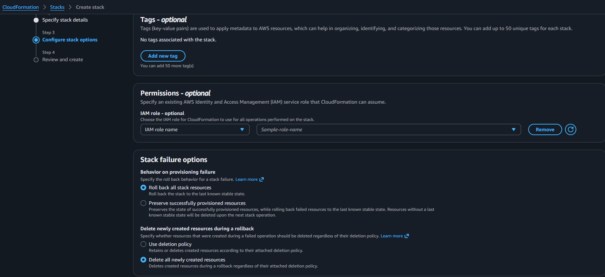
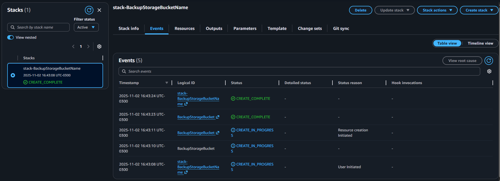
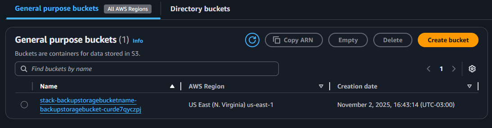

# DIO
Repositório para armazenar conhecimentos obtidos no curso DIO Santander Code Girls 2025 - Desenvolvimento e Ferramenta.

# AWS IaC e Cloud Formation

IaC (Infrastructure as Code) é a prática de definir e gerenciar toda a infraestrutura de TI através de código, em vez de configurá-la manualmente pelo console.

CloudFormation é o serviço AWS que implementa este conceito através da automatização da criação, configuração e gerenciamento de toda a infraestrutura em nuvem usando arquivos de configuração (templates em YAML ou JSON).

Ou seja, ao invés de criar manualmente, os recursos necessários são configurados em um template que é executado no CloudFormation e utilizado para que a AWS provisione automaticamente todos esses recursos.

Algumas das principais vantagens de utilizar esta abordagem são:
- Padronização: todos os ambientes utilizam a mesma configuração.
- Replicação: facilidade o processo de replicar a infraestrutura em outra região.
- Controle de versão: sincronização com Git é disponível, permitindo armazenar e versionar os templates
- Automação: a infraestrutura é criada através da utilizaçãod e um único recurso.
- Falhas: em caso de falhas, o CloudFormation possui a capacidade de reverter todas as mudanças.

# Criando um S3 Bucket utilizando CloudFormation

- Busque por "cloud formation" na barra de pesquisa, acesse o serviço e selecione a opção de "Create stack".

- Visto que o objetivo é utilizar o código compartilhado acima como template para fazer a criação do S3, selecionar "Choose an existing template" e "Upload a template file". Em seguida, acesse a opção de selecionar o arquivo e selecione o arquivo YAML criado.

- Na etapa de especificar detalhes da stack, definir o nome a ser utilizado.

- Na etapa de configurar opções é possível adicionar tags, definir permissões especiais de acesso para a CloudFormation com base em roles já existentes, adicionar políticas, configurar notificações aplicar outras configurações. Nesse exemplo, atualizar a política de falhas para que caso aconteça uma falha na criação dos recursos, aconteça um rollback de toda a stack (ou seja, nenhuma ação será realizada).

- A última etapa é para revisão de todas as configurações realizadas. Confirmando que tudo está correto, clicar em "Submit" para que a criação do recurso seja concluído.

- Após alguns segundos, os eventos serão atualizados na lista e os status de CREATE_IN_PROGRESS e CREATE_COMPLETE aparecerão, detalhando que a criação ocorreu e foi finalizada.

- Por fim, ao acessar o S3, é possível encontrar o bucket criado via CloudFormation - comprovando o correto funcionando do recurso.
